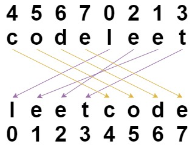

#Shuffle String
ou are given a string `s` and an integer array `indices` of the **same length**. The string `s` will be shuffled such that the character at the `ith` position moves to `indices[i]` in the shuffled string.

Return the shuffled string.

##Example 1:

>Input: s = "codeleet", indices = [4,5,6,7,0,2,1,3] 
Output: "leetcode" 
Explanation: As shown, "codeleet" becomes "leetcode" after shuffling. 

##Example 2:

>Input: s = "abc", indices = [0,1,2] 
Output: "abc" 
Explanation: After shuffling, each character remains in its position. 

##Constraints:

- `s.length == indices.length == n`
- `1 <= n <= 100`
- `s consists of only lowercase English letters.`
- `0 <= indices[i] < n`
- `All values of indices are unique.`
